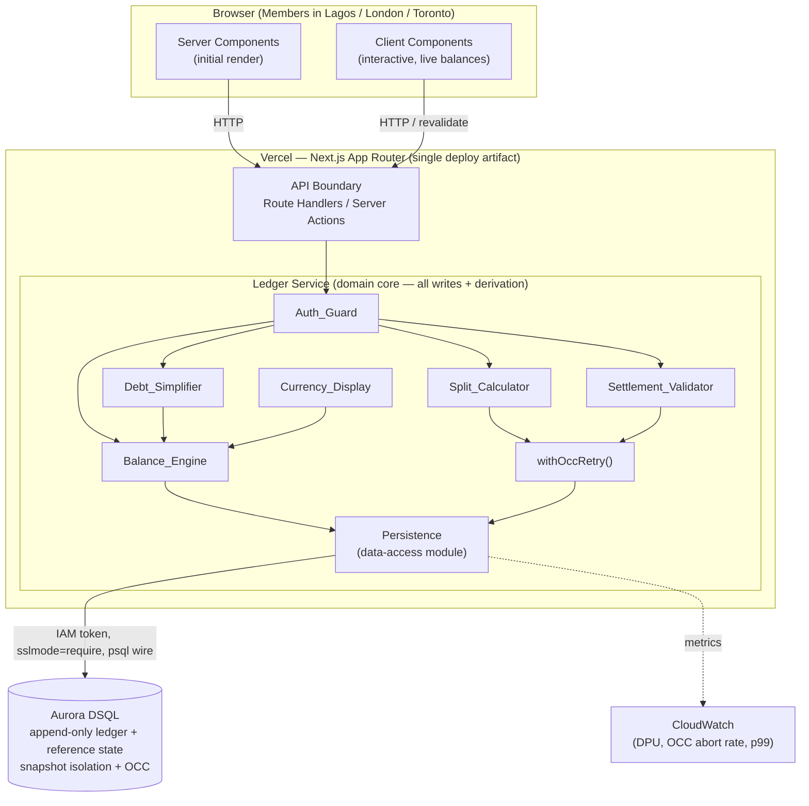
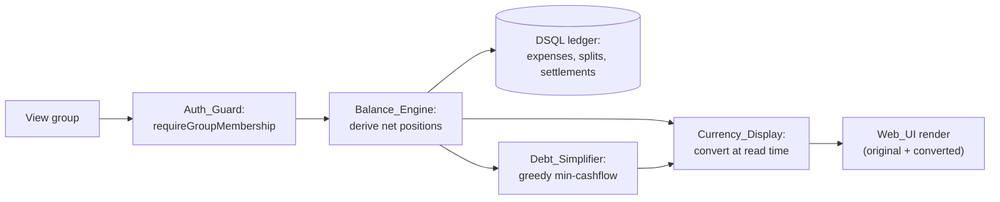
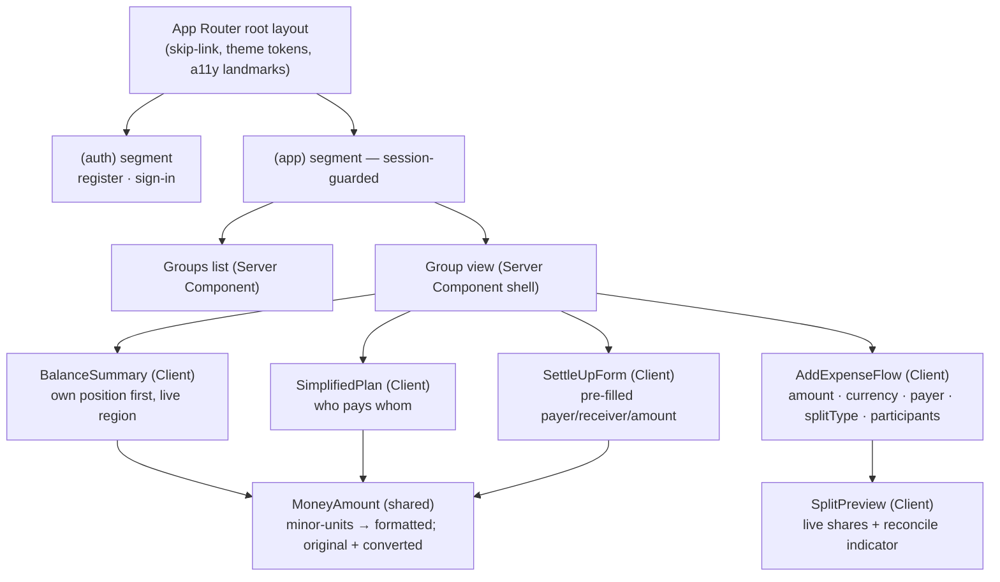
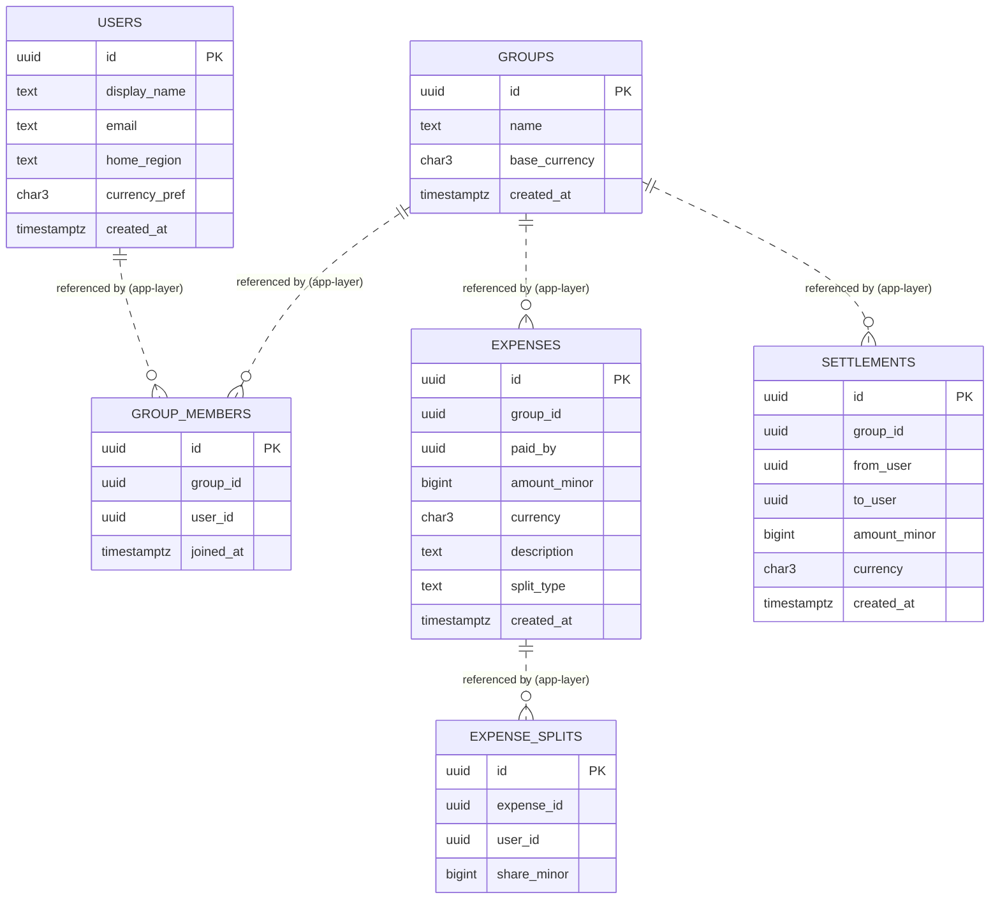

# Design Document

## Overview

LedgerLoop is a multi-region group expense ledger built as a **layered serverless monolith**: a Next.js App Router application on Vercel that hosts the Web UI, the API boundary, and the Ledger Service, all backed by a single Aurora DSQL database. The design realizes Candidate A from `LEDGERLOOP_ARCHITECTURE.md` (the selected architecture) plus the one borrowed idea from Candidate B: an **append-only ledger with derived balances**.

The central design principle is that **balance is an output, not state**. Expenses, expense splits, and settlements are immutable inserts. A member's net position in a group is always derived on the read path by summing the ledger. This is what makes concurrency safe: writes only ever *append* rows, so conflicting concurrent edits collide on inserts where Aurora DSQL's snapshot isolation plus optimistic concurrency control (OCC) aborts one writer with `SQLSTATE 40001` instead of silently losing an update. The Ledger Service retries the aborted write against fresh state.

The design is organized around six correctness invariants drawn from the architecture and the requirements:

| Invariant | Statement | Primary requirement | Enforced by |
|-----------|-----------|---------------------|-------------|
| INV-1 | The sum of an expense's splits equals the expense amount | Req 7.9 | `Split_Calculator` + atomic transaction in `Persistence` |
| INV-2 | The sum of all member net positions in a group is exactly zero | Req 9.3 | `Balance_Engine` derivation (follows from INV-1) |
| INV-3 | No expense or settlement is double-counted under concurrent writes | Req 11.5 | DSQL OCC (40001) + `withOccRetry` |
| INV-4 | Money is always an integer in minor units, never a float | Req 12.1, 12.2 | `BIGINT` storage + TypeScript `bigint`/integer discipline |
| INV-5 | A settlement cannot exceed what the payer currently owes the receiver | Req 8.6 | `Settlement_Validator` against derived ledger |
| INV-6 | Every ledger row references a real group/member/membership | Req 13 | `Auth_Guard` + `Persistence` referential checks (DSQL has no FK) |

This document covers all 22 requirements: identity and authentication (Req 1–2), groups and membership (Req 3–4), authorization (Req 5), the three core MVP features — expense splitting (Req 6–7), settlement (Req 8), balance viewing (Req 9) and debt simplification (Req 10) — concurrency (Req 11), money representation (Req 12), referential integrity (Req 13), multi-currency display (Req 14), the user-experience foundation (Req 15–18), the frontend stack (Req 19), performance (Req 20), data minimization (Req 21), and error handling (Req 22).

### Scope boundaries (from requirements and architecture)

- MVP tracks and simplifies debt; it does **not** move real money. No card or bank credentials are collected (Req 21.1).
- Single-region deployment for the demo; the architecture is multi-region active-active capable and that is described as the scale story, not built.
- Aurora DSQL constraints are treated as hard design constraints: **no foreign keys, no sequences, no triggers, no views, no JSON columns, ≤10K rows per transaction, secondary indexes via `CREATE INDEX ASYNC`**.

## Architecture

### Layered information flow

The system is a strict linear chain. The browser never touches Persistence directly (Req 19.6); every financial mutation passes through the API boundary into the Ledger Service, which owns all writes and all balance derivation.



### Request lifecycles

**Write path (add expense / record settlement).** Every mutation is guarded, validated, computed, then appended atomically with OCC retry.

```mermaid
sequenceDiagram
    participant UI as Client Component
    participant API as API Boundary
    participant AG as Auth_Guard
    participant LS as Ledger Service logic
    participant OCC as withOccRetry
    participant DB as Aurora DSQL

    UI->>API: submit expense (minor units, splitType, members)
    API->>AG: requireGroupMembership(caller, groupId)
    AG->>DB: SELECT membership (caller + all assigned members)
    alt caller or any assigned member not a member
        AG-->>UI: 403 authorization failure (no group contents)
    else authorized
        AG->>LS: validate fields + compute splits (Split_Calculator)
        alt validation fails (INV-1, percent≠100, amount range, ...)
            LS-->>UI: 422 validation error (field-scoped, input preserved)
        else valid
            LS->>OCC: append expense + splits
            OCC->>DB: BEGIN; INSERT expense; INSERT splits; COMMIT
            alt SQLSTATE 40001 (conflict)
                OCC->>DB: retry on fresh snapshot (bounded, jittered backoff)
            end
            alt retries exhausted / other failure
                LS-->>UI: error, ledger unchanged
            else committed
                LS-->>UI: confirmed; UI revalidates balances
            end
        end
    end
```

**Read path (balances, simplified plan, currency display).** The read path takes no locks and writes nothing (Req 10.6).



### Why this architecture (mapped to requirements)

- **Append-only ledger + derived balances** → directly serves INV-2/INV-3 (Req 9, 11) and the immutability requirements (Req 6.6, 6.7, 8.1).
- **Single Ledger Service owning all writes** → centralizes INV-1/3/5/6 enforcement (Req 7, 11, 8, 13) so authorization and referential integrity cannot be bypassed (Req 5, 19.6).
- **Single Aurora DSQL database** → INV-3 becomes a database guarantee (OCC) rather than application coordination; there is no cross-service saga to get wrong.
- **Next.js App Router with Server/Client Components** → serves the SSR + live-update UX (Req 9.6, 19.1, 19.5) and the performance budget (Req 20).

### Technology stack

| Concern | Choice | Requirement basis |
|---------|--------|-------------------|
| Framework | Next.js (App Router) | Req 19.1, 19.5 |
| Language | TypeScript, strict, type-check enforced in build | Req 19.2 |
| Styling | Tailwind CSS with shared design tokens | Req 19.3 |
| Component foundation | Accessible headless primitives (e.g. Radix UI) wrapped in app components | Req 17, 19.4 |
| DB driver | `postgres` (porsager) over DSQL psql wire; IAM token as password | Architecture §5, §8 |
| Database | Aurora DSQL, single region | Architecture §3 |
| Auth | Session-based (HTTP-only cookie); credentials verified server-side | Req 2 |
| Hosting | Vercel | Architecture §3 |
| Observability | CloudWatch (DPU, OCC abort rate, p99 latency) | Architecture §3, §9 |

## Components and Interfaces

The Ledger Service is the domain core. Each sub-component has a single responsibility and a typed interface. All amounts are integers in minor units (INV-4); the design uses TypeScript `number` only where values are provably within safe integer range and `bigint` at the persistence boundary where `BIGINT` can exceed `Number.MAX_SAFE_INTEGER` (see Data Models note on large amounts).

### Shared domain types

```typescript
type SplitType = "equal" | "percent" | "exact";

interface Split { userId: string; shareMinor: number; }

interface ExpenseInput {
  groupId: string;
  paidBy: string;
  amountMinor: number;      // positive integer, minor units (INV-4)
  currency: string;         // ISO-4217, validated
  description: string;      // 1..500 chars, non-whitespace
  splitType: SplitType;
  participants: string[];   // members sharing the expense (non-empty)
  percents?: number[];      // required for 'percent', aligned to participants
  exactShares?: number[];   // required for 'exact', aligned to participants
}

interface SettlementInput {
  groupId: string;
  fromUser: string;         // payer
  toUser: string;           // receiver
  amountMinor: number;      // positive integer, minor units
  currency: string;         // ISO-4217, validated
}

interface Transfer { from: string; to: string; amountMinor: number; }

type Result<T> =
  | { ok: true; value: T }
  | { ok: false; error: DomainError };

interface DomainError {
  category:
    | "validation"
    | "authorization"
    | "not_found"
    | "referential_integrity"
    | "invariant"
    | "conflict_exhausted"
    | "unavailable";
  field?: string;           // for validation errors (Req 6.4, 8.4, 8.5)
  message: string;          // user-safe, PII-free (Req 21.4)
  maxSettleableMinor?: number; // for INV-5 rejections (Req 8.7)
}
```

### Auth_Guard

Confirms the caller (and, for writes, every member referenced by the operation) holds a membership in the target group before any group-scoped read or write proceeds. This is the single chokepoint that satisfies Req 5 and the authorization half of INV-6 (Req 13).

```typescript
interface AuthGuard {
  // Req 5.1, 5.2 — gate every group-scoped read/write.
  requireGroupMembership(callerId: string, groupId: string): Promise<Result<void>>;

  // Req 5.3, 5.5, 13.1 — payer AND every assigned split member must be members.
  requireExpenseParticipantsAreMembers(
    groupId: string, paidBy: string, participants: string[]
  ): Promise<Result<void>>;

  // Req 5.4, 13.2 — both payer and receiver must be members.
  requireSettlementPartiesAreMembers(
    groupId: string, fromUser: string, toUser: string
  ): Promise<Result<void>>;
}
```

Behavior:
- A failed membership check returns `{ category: "authorization" }` and never includes any group contents (Req 5.2, 21.4).
- For expenses, if any assigned member is not a group member, the *entire* operation is blocked — no expense and no splits are written (Req 5.5).
- Group-existence failures surface as `{ category: "not_found" }` (Req 4.3, 13.3).

### Split_Calculator

Computes per-member shares from a split type and inputs, guaranteeing INV-1 (shares sum exactly to the amount) and deterministic remainder distribution (Req 7).

```typescript
interface SplitCalculator {
  // Req 7.1, 7.2 — equal split with deterministic remainder distribution.
  equalSplit(amountMinor: number, userIds: string[]): Split[];

  // Req 7.3 — percentage split; rounding drift assigned deterministically.
  percentSplit(amountMinor: number, userIds: string[], percents: number[]): Result<Split[]>;

  // Req 7.5, 7.6 — exact split; accepted only if shares sum to amount.
  exactSplit(amountMinor: number, userIds: string[], shares: number[]): Result<Split[]>;
}
```

Key algorithms (from architecture §5):

```typescript
// Equal split: base = floor(amount/n); first `remainder` members pay one extra minor unit.
// Σ shareMinor === amountMinor by construction (INV-1). Deterministic for identical
// ordered inputs (Req 7.2). No two shares differ by more than one minor unit (Req 7.2).
function equalSplit(amountMinor: number, userIds: string[]): Split[] {
  const n = userIds.length;
  const base = Math.floor(amountMinor / n);
  const remainder = amountMinor - base * n;     // 0..n-1
  return userIds.map((userId, i) => ({
    userId,
    shareMinor: base + (i < remainder ? 1 : 0),
  }));
}
```

- **Percent split (Req 7.3, 7.4):** reject unless percentages sum to exactly 100. Compute each raw share as `floor(amountMinor * pct / 100)`, then assign the leftover minor units (the rounding drift) deterministically — one unit at a time to the members with the largest fractional parts (ties broken by participant order) — so the shares sum exactly to `amountMinor`.
- **Exact split (Req 7.5, 7.6):** accept only if `Σ shares === amountMinor`; otherwise reject with a validation message and write nothing.
- All shares are non-negative integers in minor units (Req 7.8).
- Empty participant set is rejected upstream (Req 6.4, 7.7), but `equalSplit` is never called with `n = 0`.

### Settlement_Validator

Validates a settlement before it is recorded, enforcing INV-5 (Req 8.6, 8.7) and the structural rules (Req 8.2–8.5, 8.8).

```typescript
interface SettlementValidator {
  // Returns the maximum the payer may settle to the receiver right now,
  // derived from the append-only ledger (no stored balance).
  maxSettleable(groupId: string, fromUser: string, toUser: string): Promise<number>;

  validate(input: SettlementInput): Promise<Result<void>>;
}
```

Validation order (each failure leaves the ledger unchanged — Req 8.4, 8.5, 8.7, 8.8):
1. Required fields present (group, payer, receiver, amount, currency) → else `validation` with `field` (Req 8.5).
2. Amount is a positive integer in minor units (Req 8.2); currency is valid ISO-4217 (Req 8.3) → else `validation` (Req 8.4).
3. Payer ≠ receiver → else `validation` (Req 8.8).
4. `amountMinor ≤ maxSettleable(...)` (Req 8.6) → else `validation` with `maxSettleableMinor` set so the UI can state the maximum (Req 8.7).

`maxSettleable` is the pairwise amount the payer currently owes the receiver, computed from the group's simplified pairwise debt derived from the ledger (the same derivation the Balance_Engine and Debt_Simplifier use). It is the cap for what one member may pay another.

### Balance_Engine

Derives every member's net position in a group from the append-only ledger; never reads or writes a stored balance (Req 9.1, 9.2). Guarantees INV-2 (Req 9.3).

```typescript
interface BalanceEngine {
  // Net position per member, minor units. Positive = creditor (owed),
  // negative = debtor (owes). Σ over a group === 0 (INV-2).
  deriveNetPositions(groupId: string): Promise<Map<string, number>>;

  // Pairwise "who owes whom" used by settle-up pre-fill and the INV-5 cap.
  derivePairwiseDebts(groupId: string): Promise<Transfer[]>;
}
```

Sign convention (the architecture's corrected convention — a flipped settlement sign is a documented critical pitfall):

```
net(member) =  Σ amount_minor of expenses the member PAID
             − Σ share_minor of the member's splits
             + Σ amount_minor of settlements the member SENT (from_user)
             − Σ amount_minor of settlements the member RECEIVED (to_user)
```

Recording a settlement of amount A from payer to receiver moves the payer's net **up** by A toward zero and the receiver's net **down** by A toward zero (Req 9.4). A group with no expenses and no settlements derives zero for every member (Req 9.7). The derivation SQL is in Data Models.

> Critical: INV-2 (sum-to-zero) holds for *either* settlement sign convention, so a sum-to-zero check alone cannot catch a flipped sign. The testing strategy adds an explicit **direction** property (after A pays B, A's net moves up) to catch this.

### Debt_Simplifier

Computes a minimum-payment transfer plan from the derived net positions, on the read path, holding no locks (Req 10).

```typescript
interface DebtSimplifier {
  // Greedy min-cashflow: repeatedly settle the largest debtor against the
  // largest creditor. Worst case (n-1) transfers for n non-zero members.
  simplifyDebts(net: Map<string, number>): Transfer[];
}
```

Guarantees:
- Each member's (received − sent) across the plan equals that member's net position (Req 10.2) — flows from the greedy algorithm and INV-2.
- At most one fewer transfer than the count of members with non-zero net position (Req 10.3).
- Empty plan when all nets are zero (Req 10.4).
- Each transfer is a positive integer minor-units amount from a payer to a distinct receiver (Req 10.7).
- Pure function of the net map; computed without locks or writes (Req 10.6).

### Currency_Display

Converts stored amounts to a viewer's preferred currency at read time, never mutating stored data (Req 14).

```typescript
interface CurrencyDisplay {
  // Returns converted amount + the original, or signals conversion unavailable.
  convert(amountMinor: number, fromCurrency: string, toCurrency: string):
    | { converted: true; amountMinor: number; rate: FxRate; original: { amountMinor: number; currency: string } }
    | { converted: false; original: { amountMinor: number; currency: string } };
}

interface FxRate { from: string; to: string; ratePpm: number; asOf: string; } // rate in parts-per-million to stay integer-friendly
```

Behavior:
- Conversion happens at read/display time only; stored expense/split/settlement amounts are never altered (Req 14.1, 14.5).
- When no FX rate is available for the (stored currency, preference) pair, the UI shows the original currency and amount and indicates conversion is unavailable (Req 14.4, 10.8).
- The original currency and amount are always available alongside any converted value (Req 14.3).
- Same-currency conversion is the identity (rate = 1) and always available.

### Persistence

The Aurora DSQL data-access module. Owns connection handling, atomic transactions, the OCC retry wrapper, and app-layer referential integrity (the INV-6 tax that DSQL's missing foreign keys impose).

```typescript
interface Persistence {
  // Atomic append of an expense + its splits in a single transaction (Req 6.1, 6.11).
  insertExpenseWithSplits(expense: ExpenseRow, splits: SplitRow[]): Promise<Result<string>>;

  insertSettlement(settlement: SettlementRow): Promise<Result<string>>;

  // Reference state writes
  insertUser(user: UserRow): Promise<Result<string>>;
  insertGroup(group: GroupRow): Promise<Result<string>>;
  insertMembership(m: MembershipRow): Promise<Result<string>>;  // idempotent on (group_id,user_id) via unique index (Req 4.2, 13.4)
  updateCurrencyPreference(userId: string, code: string): Promise<Result<void>>;

  // Reads for derivation
  loadLedger(groupId: string): Promise<LedgerSnapshot>;
  membershipExists(groupId: string, userId: string): Promise<boolean>;
  groupExists(groupId: string): Promise<boolean>;
}

// OCC retry wrapper — INV-3 lives here.
function withOccRetry<T>(fn: () => Promise<T>, max?: number): Promise<T>;
```

Behavior:
- `withOccRetry` retries on `SQLSTATE 40001` with bounded attempts and jittered exponential backoff (Req 11.2, 11.3). Exhausted retries return `{ category: "conflict_exhausted" }` and the ledger is unchanged for that operation (Req 11.4).
- All writes use application-generated UUIDs (`crypto.randomUUID()`) because DSQL has no sequences (Req 1.6, 3.4, 6.8, 8.9).
- Connections use IAM-token auth with `sslmode=require` and are reused across invocations (architecture §8).
- Duplicate membership inserts are prevented by a unique index on `(group_id, user_id)` and treated idempotently (Req 4.2, 13.4).

### API Boundary

Next.js route handlers / server actions expose the Ledger Service to the Web UI. Responsibilities:
- Authenticate the session and resolve the caller's member id (Req 2.3): unauthenticated requests to group-scoped routes are redirected to sign-in.
- Convert `DomainError` categories into HTTP responses and UI-safe messages (Req 22.2), stripping PII (Req 21.3, 21.4).
- Never expose direct database access to the browser (Req 19.6).

### Frontend component architecture

The Web UI is composed from an accessible component foundation (Req 19.4) with shared Tailwind design tokens (Req 19.3). Server Components render initial content; Client Components add interactivity and live updates (Req 19.5).



Key screens and journeys:

- **Add-expense flow (Req 15):** a single primary flow exposes amount, currency, description, payer, split type, and participant selection (Req 15.1). For `equal`, each participant's computed share is shown before submit (Req 15.2). For `percent`/`exact`, a running total versus the amount plus a reconcile indicator is shown (Req 15.3); submission is blocked with the outstanding difference shown if shares do not reconcile (Req 15.4). On success the member is returned to the group view with updated balances (Req 15.5); on rejection entered values are preserved and the reason is shown next to the relevant field (Req 15.6, 22.4).
- **View-balances and settle-up (Req 16):** the member's own net position is shown prominently first (Req 16.1); who-owes-whom is presented in plain language (Req 16.2); initiating settle-up from a displayed debt pre-fills payer, receiver, and amount owed (Req 16.3); confirmation shows the recorded settlement and resulting balances (Req 16.4); a member with no non-zero position sees a settled-up state (Req 16.5).
- **Live updates (Req 9.6):** after a committed write, the viewing client revalidates and presents updated net positions within 2 seconds without a manual reload, announced to assistive tech via an ARIA live region (Req 17.6).
- **Money display (Req 12.3, 12.4, 14.3):** the shared `MoneyAmount` component formats integer minor units into correct major/minor presentation for the currency and always exposes the original amount alongside any conversion. Input fields convert entered major-unit values to integer minor units before submission.

Accessibility, responsive, and performance behaviors are cross-cutting concerns implemented in this foundation; they are detailed under Error Handling and Testing Strategy where relevant and mapped to Req 17, 18, and 20.

## Data Models

All tables use application-generated UUID primary keys (no sequences). Money is `BIGINT` minor units (INV-4). DSQL constraints respected: no FK, no triggers, no views, no JSON; secondary indexes created with `CREATE INDEX ASYNC`. `CHECK`, `PRIMARY KEY`, `NOT NULL`, `DEFAULT`, and `UNIQUE` (via unique async index) are supported.

### Entity relationship (logical, not enforced by DB foreign keys)



The `..o{` relationships denote logical references resolved in the application layer (INV-6, Req 13), not database foreign keys — DSQL has none.

### DSQL-safe DDL

```sql
-- Reference state. PII limited to display_name, email, home_region (Req 21.2).
CREATE TABLE users (
  id            UUID PRIMARY KEY,
  display_name  TEXT NOT NULL,
  email         TEXT NOT NULL,
  home_region   TEXT NOT NULL,
  currency_pref CHAR(3) NOT NULL DEFAULT 'USD',     -- deterministic default (Req 1.1)
  created_at    TIMESTAMPTZ NOT NULL DEFAULT now()
);

CREATE TABLE groups (
  id            UUID PRIMARY KEY,
  name          TEXT NOT NULL,
  base_currency CHAR(3) NOT NULL DEFAULT 'USD',
  created_at    TIMESTAMPTZ NOT NULL DEFAULT now()
);

CREATE TABLE group_members (
  id        UUID PRIMARY KEY,
  group_id  UUID NOT NULL,
  user_id   UUID NOT NULL,
  joined_at TIMESTAMPTZ NOT NULL DEFAULT now()       -- Req 4.5
);
CREATE INDEX ASYNC idx_members_group ON group_members (group_id);
CREATE INDEX ASYNC idx_members_user  ON group_members (user_id);
-- Unique membership prevents duplicate joins (Req 4.2, 13.4 / INV-6).
CREATE UNIQUE INDEX ASYNC idx_members_uniq ON group_members (group_id, user_id);

-- Append-only ledger. Never UPDATE; corrections are new reversing rows (Req 6.6, 6.7).
CREATE TABLE expenses (
  id           UUID PRIMARY KEY,
  group_id     UUID NOT NULL,
  paid_by      UUID NOT NULL,
  amount_minor BIGINT NOT NULL CHECK (amount_minor > 0),   -- Req 6.2 (≥1)
  currency     CHAR(3) NOT NULL,
  description  TEXT NOT NULL,
  split_type   TEXT NOT NULL CHECK (split_type IN ('equal','percent','exact')),
  created_at   TIMESTAMPTZ NOT NULL DEFAULT now()
);
CREATE INDEX ASYNC idx_expenses_group ON expenses (group_id);

CREATE TABLE expense_splits (
  id          UUID PRIMARY KEY,
  expense_id  UUID NOT NULL,
  user_id     UUID NOT NULL,
  share_minor BIGINT NOT NULL CHECK (share_minor >= 0)     -- Req 7.8; Σ == expense.amount (INV-1)
);
CREATE INDEX ASYNC idx_splits_expense ON expense_splits (expense_id);

CREATE TABLE settlements (
  id           UUID PRIMARY KEY,
  group_id     UUID NOT NULL,
  from_user    UUID NOT NULL,
  to_user      UUID NOT NULL,
  amount_minor BIGINT NOT NULL CHECK (amount_minor > 0),   -- Req 8.2
  currency     CHAR(3) NOT NULL,
  created_at   TIMESTAMPTZ NOT NULL DEFAULT now()          -- Req 8.9
);
CREATE INDEX ASYNC idx_settlements_group ON settlements (group_id);
```

### Balance derivation query (INV-2)

```sql
-- Net position per member of a group. Positive = creditor, negative = debtor.
-- Sign convention (corrected): +paid, -owed, +settled_out, -settled_in.
SELECT m.user_id,
         COALESCE(paid.total, 0)        - COALESCE(owed.total, 0)
       + COALESCE(settled_out.total, 0) - COALESCE(settled_in.total, 0) AS net_minor
FROM group_members m
LEFT JOIN (SELECT paid_by uid, SUM(amount_minor) total FROM expenses
           WHERE group_id = $1 GROUP BY paid_by) paid          ON paid.uid = m.user_id
LEFT JOIN (SELECT s.user_id uid, SUM(s.share_minor) total FROM expense_splits s
           JOIN expenses e ON e.id = s.expense_id
           WHERE e.group_id = $1 GROUP BY s.user_id) owed       ON owed.uid = m.user_id
LEFT JOIN (SELECT from_user uid, SUM(amount_minor) total FROM settlements
           WHERE group_id = $1 GROUP BY from_user) settled_out  ON settled_out.uid = m.user_id
LEFT JOIN (SELECT to_user uid, SUM(amount_minor) total FROM settlements
           WHERE group_id = $1 GROUP BY to_user) settled_in     ON settled_in.uid = m.user_id
WHERE m.group_id = $1;
-- Demo property: SUM(net_minor) MUST be 0 (INV-2). The join on e.id is a plain
-- indexed-column join, not a declared FK (DSQL has none).
```

### Field-level validation rules (consolidated)

| Field | Rule | Requirement |
|-------|------|-------------|
| `display_name` | trim; 1–100 chars; reject empty/whitespace/over-100 | Req 1.1, 1.3 |
| `email` | ≤254 chars; valid email format; failure does not reveal existence at sign-in | Req 1.1, 1.4, 2.2 |
| `currency_pref` / `currency` / `base_currency` | valid ISO-4217 three-letter code | Req 1.5, 1.7, 3.2, 6.3, 8.3 |
| `amount_minor` (expense) | integer, 1 .. 9,223,372,036,854,775,807 | Req 6.2, 6.9 |
| `amount_minor` (settlement) | positive integer; ≤ max settleable | Req 8.2, 8.6 |
| `description` | present; non-whitespace; ≤500 chars | Req 6.4 |
| `split_type` | one of equal/percent/exact | Req 6.1 |
| `participants` | non-empty; all are group members | Req 6.4, 7.7, 5.5 |
| `percents` | sum to exactly 100 | Req 7.4 |
| `exactShares` | sum to `amount_minor` | Req 7.6 |
| settlement payer/receiver | distinct; both group members | Req 8.8, 5.4 |

### Large-amount handling (INV-4 safety)

`BIGINT` permits values above `Number.MAX_SAFE_INTEGER` (2^53−1), while the upper bound in Req 6.2/6.9 is 2^63−1. To keep INV-4 exact and avoid float corruption, the persistence layer maps `amount_minor`/`share_minor` to JavaScript `bigint` (or validated safe-integer `number` when provably within range), and arithmetic in `Split_Calculator`/`Balance_Engine` is integer-only. No monetary value is ever represented as a floating-point number (Req 12.1, 12.2).

### FX rate model (configuration, cached)

FX rates are configuration, not ledger state. A cached daily snapshot keyed by `(from, to)` provides `ratePpm` (parts-per-million) so conversion stays integer-friendly. A missing key means "conversion unavailable" (Req 14.4, 10.8). Rates never feed back into stored ledger amounts (Req 14.5).

## Correctness Properties

*A property is a characteristic or behavior that should hold true across all valid executions of a system — essentially, a formal statement about what the system should do. Properties serve as the bridge between human-readable specifications and machine-verifiable correctness guarantees.*

LedgerLoop's domain core (`Split_Calculator`, `Balance_Engine`, `Debt_Simplifier`, `Settlement_Validator`, `Auth_Guard`, `Currency_Display`, and the `withOccRetry` wrapper) is pure logic with large input spaces and universal invariants, so property-based testing is the right tool. The properties below are the consolidated result of the prework analysis (redundant criteria were merged; UI presentation, accessibility conformance, performance metrics, and infrastructure behavior were classified out of PBT and appear in the Testing Strategy instead).

Each property is universally quantified and traces back to the requirements it validates.

### Property 1: Split shares sum exactly to the expense amount (INV-1)

*For any* valid expense — any positive integer `amountMinor` in minor units, and any split type (`equal`, `percent` with percentages summing to 100, or `exact` with shares summing to the amount) over a non-empty ordered participant set — the sum of the produced `Expense_Split` shares equals `amountMinor` exactly, and every share is a non-negative integer in minor units.

**Validates: Requirements 7.1, 7.3, 7.5, 7.8, 7.9**

### Property 2: Equal-split fairness and determinism

*For any* positive integer `amountMinor` and any ordered non-empty list of participants, `equalSplit` produces shares where (a) the sum equals `amountMinor`, (b) no two shares differ by more than one minor unit, and (c) calling it again with identical ordered inputs yields identical per-member shares.

**Validates: Requirements 7.2**

### Property 3: Non-reconciling or empty split inputs are rejected with no ledger change

*For any* expense submission whose `percent` percentages do not sum to exactly 100, whose `exact` shares do not sum to `amountMinor`, or whose participant set is empty, the `Ledger_Service` rejects the submission, writes no `Expense` and no `Expense_Split`, and returns a validation message identifying the cause.

**Validates: Requirements 7.4, 7.6, 7.7**

### Property 4: Expense field validation

*For any* expense submission that omits a required field (amount, currency, description, split type, or sharing members), supplies an amount that is not a positive integer in minor units or exceeds 9,223,372,036,854,775,807, supplies a currency that is not a valid ISO-4217 code, or supplies a description that is empty, whitespace-only, or longer than 500 characters, the `Ledger_Service` rejects the submission and returns a message identifying the offending field; and *for any* fully valid submission it is accepted without a missing-field message.

**Validates: Requirements 6.2, 6.3, 6.4, 6.5, 6.9, 6.10**

### Property 5: Expense write is atomic

*For any* expense write, either the `Expense` and all of its `Expense_Split` rows are persisted together, or none of them are; if the transaction cannot complete, neither the expense nor any split persists and an error is returned.

**Validates: Requirements 6.1, 6.11**

### Property 6: Corrections are append-only reversals

*For any* recorded `Expense`, requesting a correction produces a new reversing `Expense` and leaves the original `Expense` and its splits byte-for-byte unchanged.

**Validates: Requirements 6.6, 6.7**

### Property 7: Authorization and referential-integrity write guard (INV-6)

*For any* ledger write, if the referenced group does not exist, or the payer is not a member of the group, or any member assigned a split is not a member of the group, or (for a settlement) either the payer or the receiver is not a member, then the write is blocked, no `Expense`, `Expense_Split`, or `Settlement` is written, and an authorization or referential-integrity error is returned that does not disclose group contents.

**Validates: Requirements 5.3, 5.4, 5.5, 13.1, 13.2, 13.3**

### Property 8: Group-scoped read guard without disclosure

*For any* group-scoped read request, the `Auth_Guard` allows it if and only if the requesting member holds a membership in the target group; a non-member request returns an authorization failure whose response contains no group contents.

**Validates: Requirements 5.1, 5.2**

### Property 9: Membership creation is idempotent and unique

*For any* member and group, accepting an invitation creates exactly one `Membership` with a recorded creation timestamp, and any subsequent join attempt for the same `(member, group)` pair leaves exactly one `Membership` row unchanged.

**Validates: Requirements 4.1, 4.2, 4.5, 13.4**

### Property 10: Application-generated identifiers are unique

*For any* sequence of created `Member`, `Group`, `Expense`, or `Settlement` records, every record receives a present, application-generated identifier, all identifiers within a type are pairwise distinct, and each created `Settlement` and `Membership` also carries a present creation timestamp.

**Validates: Requirements 1.6, 3.4, 6.8, 8.9**

### Property 11: Net positions equal an independent ledger recomputation

*For any* group and any valid append-only ledger (arbitrary expenses, splits, and settlements), the `Balance_Engine`'s derived net position for every member equals the value computed by an independent reference implementation of `+paid − owed + settled_out − settled_in`, confirming balances are derived from the ledger rather than any stored value.

**Validates: Requirements 9.1, 9.2**

### Property 12: Group net positions sum to zero (INV-2)

*For any* group and any valid append-only ledger — including the empty ledger — the integer sum of all members' net positions equals exactly zero.

**Validates: Requirements 9.3, 9.7**

### Property 13: Settlement moves balances in the correct direction

*For any* group ledger and any settlement of amount `A` recorded from payer `P` to receiver `R`, the payer's derived net position increases by exactly `A` and the receiver's derived net position decreases by exactly `A` (catching a flipped settlement sign, which a sum-to-zero check alone cannot detect).

**Validates: Requirements 9.4**

### Property 14: Settlement cap (INV-5)

*For any* group ledger and any candidate settlement from payer to receiver, the `Settlement_Validator` accepts the settlement if and only if its amount is a positive integer in minor units not exceeding the amount the payer currently owes the receiver as derived from the ledger; when it exceeds that amount the settlement is rejected, the returned message reports the maximum settleable amount, and the ledger is left unchanged.

**Validates: Requirements 8.6, 8.7**

### Property 15: Settlement field validation

*For any* settlement submission that omits a required field (group, payer, receiver, amount, currency), supplies an amount that is not a positive integer in minor units, supplies a currency that is not a valid ISO-4217 code, or names the same member as both payer and receiver, the `Ledger_Service` rejects it, returns a message identifying the offending field, and leaves the ledger unchanged; *for any* otherwise valid settlement within the cap, exactly one immutable `Settlement` is recorded.

**Validates: Requirements 8.1, 8.2, 8.3, 8.4, 8.5, 8.8**

### Property 16: Simplified plan reconciles to net positions

*For any* map of net positions summing to zero, the `Debt_Simplifier` produces a plan in which, for every member, the sum of transfers received minus the sum of transfers sent equals that member's net position, and every transfer is a positive integer minor-units amount from a payer to a distinct receiver.

**Validates: Requirements 10.1, 10.2, 10.7**

### Property 17: Simplified plan is minimal and empty when settled

*For any* map of net positions, the `Debt_Simplifier` produces at most one fewer transfer than the number of members with a non-zero net position, and produces an empty plan when every net position is zero.

**Validates: Requirements 10.3, 10.4**

### Property 18: OCC retry semantics (INV-3 wrapper)

*For any* operation that fails with `SQLSTATE 40001` on the first `k` attempts and then succeeds, `withOccRetry` returns the successful result when `k` is below the bounded retry limit; *for any* operation that always fails with `40001`, it stops after the bounded number of attempts and returns a conflict-exhausted error without committing.

**Validates: Requirements 11.2, 11.4**

### Property 19: No append is double-counted under any interleaving (INV-3)

*For any* multiset of ledger appends (expenses and settlements) applied to a group under any interleaving with OCC conflict-and-retry, the resulting derived balances equal those obtained by applying the same appends serially — each append is counted exactly once.

**Validates: Requirements 11.5**

### Property 20: All monetary values are integer minor units (INV-4)

*For any* operation in the system, every stored or computed monetary value — including zero — is an integer in minor units and is never represented as a floating-point number.

**Validates: Requirements 12.1, 12.2**

### Property 21: Money formatting round-trips

*For any* integer minor-units amount and any supported currency, formatting the amount for display produces a presentation with the correct number of minor digits for that currency, and parsing a member's entered major-unit value converts it back to the same integer minor-units amount.

**Validates: Requirements 12.3, 12.4**

### Property 22: Display conversion preserves stored data and the original

*For any* stored amount and viewer currency preference for which an FX rate exists, the `Currency_Display` returns a converted amount consistent with the cached rate while also making the original currency and amount available, and performing conversions never alters any stored `Expense`, `Expense_Split`, or `Settlement` amount.

**Validates: Requirements 14.1, 14.2, 14.3, 14.5**

### Property 23: Member data is minimized and identity is created correctly

*For any* valid registration (display name 1–100 characters after trimming, valid email ≤254 characters), a `Member` is created whose stored fields are limited to display name, email, home region, currency preference, identifier, and creation timestamp, with currency preference defaulting to `USD`; *for any* invalid display name or email, the registration is rejected with the offending field identified and no `Member` is created.

**Validates: Requirements 1.1, 1.2, 1.3, 1.4, 21.2**

### Property 24: Currency-preference updates validate and preserve prior value

*For any* currency-preference update, a valid ISO-4217 three-letter code is persisted, and an invalid code is rejected with the existing preference left unchanged and a message indicating the code is invalid.

**Validates: Requirements 1.5, 1.7**

### Property 25: Group creation validates inputs and records creator membership

*For any* group-creation submission with a present name and a valid ISO-4217 base currency, a `Group` is created and the creating member is recorded as a `Membership`; *for any* submission omitting the name or supplying an invalid base currency, the submission is rejected with the offending field identified.

**Validates: Requirements 3.1, 3.2, 3.3**

### Property 26: PII is excluded from logs and cross-member messages

*For any* operation, emitted log entries contain no email address or other PII, and *for any* error or diagnostic message presented to a member, the message contains no other member's email address.

**Validates: Requirements 21.3, 21.4**

### Property 27: Non-OCC write failures leave the ledger unchanged

*For any* ledger write that fails for a reason other than an OCC conflict, the ledger is left unchanged for that operation and an error describing the failure category is returned.

**Validates: Requirements 22.1**

## Error Handling

Errors are modeled as the typed `DomainError` categories returned in `Result<T>`. The API boundary maps each category to an HTTP status and a UI-safe, PII-free message (Req 21.3, 21.4, 22.2).

| Category | Cause | HTTP | Ledger effect | UI behavior |
|----------|-------|------|---------------|-------------|
| `validation` | Bad/missing field, non-reconciling splits, self-settlement, amount over cap | 422 | Unchanged (Req 7.4/7.6/8.4/8.5) | Preserve input, show reason next to field (Req 15.6, 22.4) |
| `authorization` | Caller/party not a group member | 403 | Unchanged | Generic denial, no group contents (Req 5.2) |
| `not_found` | Group/invitation does not exist | 404 | Unchanged | Not-found state (Req 4.3) |
| `referential_integrity` | Write references missing group/member/membership | 409 | Unchanged (Req 13.3) | Actionable error |
| `invariant` | INV-1 violation detected pre-commit | 422 | Unchanged | Internal-consistency error (should be unreachable via `Split_Calculator`) |
| `conflict_exhausted` | OCC retries exhausted (Req 11.4) | 503 | Unchanged | "Could not complete, please retry"; safe to retry |
| `unavailable` | Persistence unreachable (Req 22.3) | 503 | Unchanged | Unavailability state; retry without losing entered data |

Principles:
- **All-or-nothing writes.** Expense + splits commit in one transaction (Req 6.1, 6.11); any failure (OCC-exhausted, validation, RI, infrastructure) leaves the ledger unchanged for that operation (Req 22.1).
- **OCC is invisible on success.** A write that succeeds after one or more 40001 retries returns the same outcome as a first-attempt success (Req 11.6); only exhaustion surfaces as an error.
- **Validation precedes side effects.** Field validation, INV-1 split reconciliation, authorization/RI checks, and the INV-5 cap are all evaluated before any insert, so a rejected operation never partially writes.
- **PII-safe messages and logs.** Operational logs exclude email and other PII (Req 21.3); member-facing messages never include another member's email (Req 21.4). Sign-in failures use a single non-enumerating message (Req 2.2).
- **Input preservation.** Validation and rejection responses carry enough structure (`field`) for the UI to keep in-progress input and annotate the offending control (Req 15.6, 22.4); successful operations may clear input (Req 22.5).
- **Unavailability.** When Persistence is unreachable, the UI shows an unavailability state and allows retry without data loss (Req 22.3).

## Testing Strategy

LedgerLoop uses a dual approach: **property-based tests** for the universal invariants of the domain core, and **example / integration / accessibility / performance tests** for the criteria that property testing does not fit.

### Property-based testing

- **Library:** `fast-check` with the existing test runner (Vitest/Jest). Property-based testing is not implemented from scratch.
- **Iterations:** each property test runs a minimum of **100 iterations**.
- **Tagging:** each property test is tagged with a comment referencing its design property, in the format **Feature: ledgerloop-app, Property {number}: {property_text}**.
- **One test per property:** each of Properties 1–27 is implemented by a single property-based test.
- **Generators:** custom generators produce valid and invalid expenses, settlements, ledgers, net-position maps, currency codes, FX rates, and member/group/membership graphs. Generators deliberately include edge cases noted in the prework: amounts that do not divide evenly (equal-split remainder), amounts near `2^63−1`, all-whitespace and over-length strings, non-ISO currency codes, empty ledgers and empty participant sets, self-settlements, duplicate joins, and non-member references.
- **Large amounts:** monetary generators exercise values above `Number.MAX_SAFE_INTEGER` using `bigint` to keep INV-4 exact (Req 12.1).
- **Mocks for cost control:** Properties that touch persistence (5, 6, 7, 8, 9, 10, 14, 15, 18, 19, 22, 27) run against an in-memory fake of the `Persistence` interface so 100+ iterations are cheap; the fake models OCC by injecting `40001` conflicts for Properties 18 and 19.
- **Model-based testing:** Properties 11 and 19 compare the production `Balance_Engine` against an independent reference summation and compare interleaved-append outcomes against serial application.

### Unit / example tests

Focused example tests cover specific behaviors and integration points that are not universal:
- Authentication lifecycle: valid sign-in establishes a session (Req 2.1), sign-out requires re-auth (Req 2.4), unauthenticated access to group-scoped routes redirects to sign-in (Req 2.3).
- UI flow behaviors for add-expense (Req 15.1–15.6), view-balances and settle-up (Req 16.1–16.5), creditor/debtor non-color indicators (Req 9.5), live-update announcements (Req 17.6), and the FX-unavailable fallback (Req 10.8, 14.4).
- OCC backoff is bounded between attempts (Req 11.3) and double-submit is prevented with an in-progress indicator (Req 20.5).
- Architecture guard: no database driver is present in the client bundle and all mutations route through the API (Req 19.6).

### Accessibility testing (Req 17)

- Automated `axe-core` checks integrated into component and end-to-end tests for every core flow (registration, sign-in, group creation, joining, add expense, view balances, simplify debts, settle).
- Contrast verified against design tokens for the 4.5:1 / 3:1 minimums (Req 17.2).
- Manual screen-reader and keyboard-only passes validate focus visibility, control labeling, error association, live-region announcements, and the skip-to-content mechanism (Req 17.3–17.7). Full WCAG 2.1 AA conformance (Req 17.1) requires this manual review in addition to automated checks.

### Responsive testing (Req 18)

- Component and end-to-end tests run at 320px, tablet, and desktop viewports asserting no horizontal scroll and no loss of function (Req 18.1, 18.3).
- Touch-target sizes (≥44×44px) verified via layout assertions; touch flows verified without hover-only interactions (Req 18.2, 18.4).
- Visual regression snapshots guard reflow across breakpoints.

### Performance testing (Req 20)

- Lighthouse CI on the representative mobile profile gates LCP ≤ 2.5s, CLS ≤ 0.1, and post-commit confirmation ≤ 2s at p75 (Req 20.1, 20.3, 20.4); INP ≤ 200ms is tracked via field/RUM data (Req 20.2).
- The 2-second live-balance update (Req 9.6) is verified end-to-end after a committed write.

### Infrastructure / integration testing

- DSQL concurrency: a two-client simultaneous-write test asserts one transaction aborts with `SQLSTATE 40001`, the retry re-applies it, both writes land, and INV-2 still holds (Req 11.1) — this is the live concurrency story.
- DDL smoke test: schema deploys on DSQL using `CREATE INDEX ASYNC`, with no foreign keys, sequences, triggers, views, or JSON columns; `psql` v14+ connects with IAM token auth and `sslmode=require`.
- Data-minimization smoke test: the schema contains no payment-card or bank-credential columns (Req 21.1).
- Stack/build smoke tests: Next.js App Router builds, TypeScript type-checking is enforced in the build, and Tailwind design tokens are present (Req 19.1–19.5).

### Requirements coverage summary

- Property-based (Properties 1–27): Req 1.1–1.7, 3.1–3.4, 4.1–4.2, 4.5, 5.1–5.5, 6.1–6.11, 7.1–7.9, 8.1–8.9, 9.1–9.4, 9.7, 10.1–10.4, 10.7, 11.2, 11.4, 11.5, 12.1–12.4, 13.1–13.4, 14.1–14.3, 14.5, 21.2–21.4, 22.1.
- Example/integration/a11y/performance: Req 2.x, 3.5, 4.3–4.4, 9.5–9.6, 10.5–10.6, 10.8, 11.1, 11.3, 11.6, 14.4, 15.x, 16.x, 17.x, 18.x, 19.x, 20.x, 21.1, 22.2–22.5.

Every acceptance criterion across all 22 requirements is mapped to at least one test in the matrix above.
