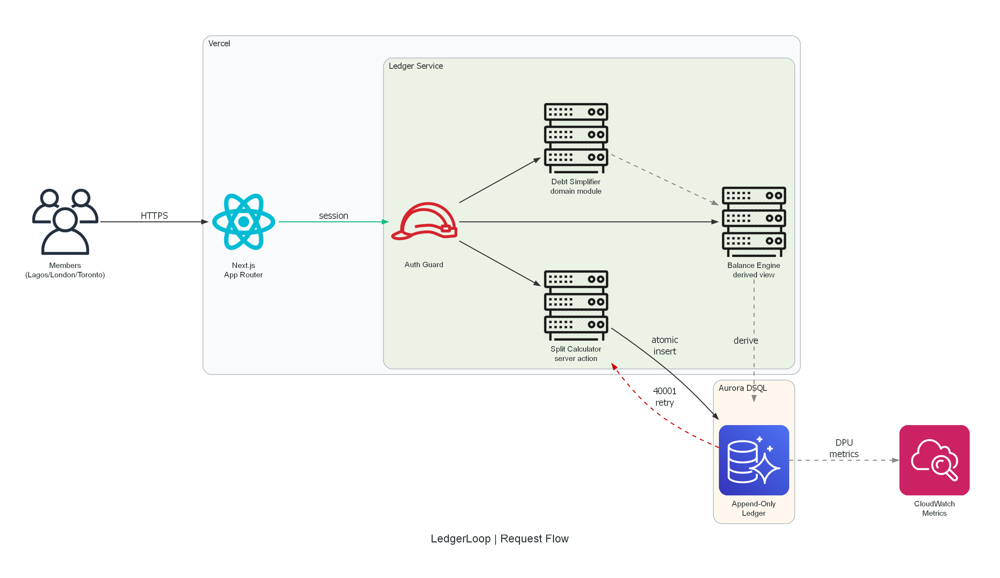
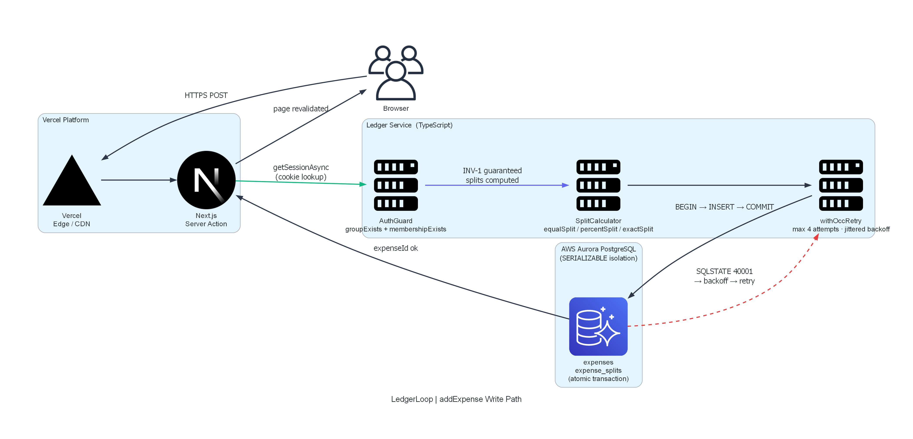
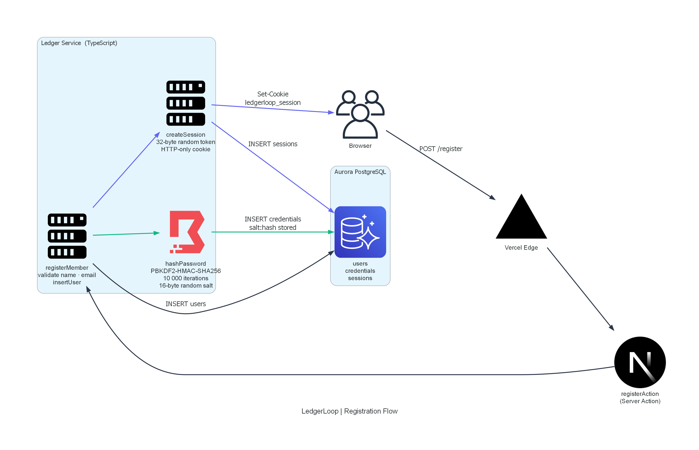
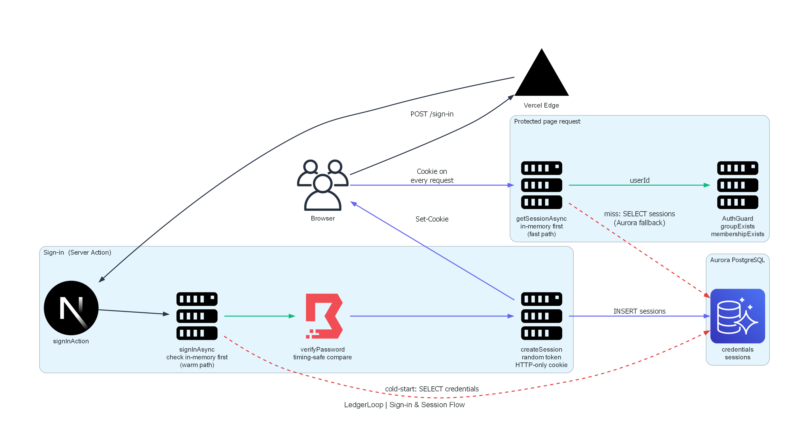
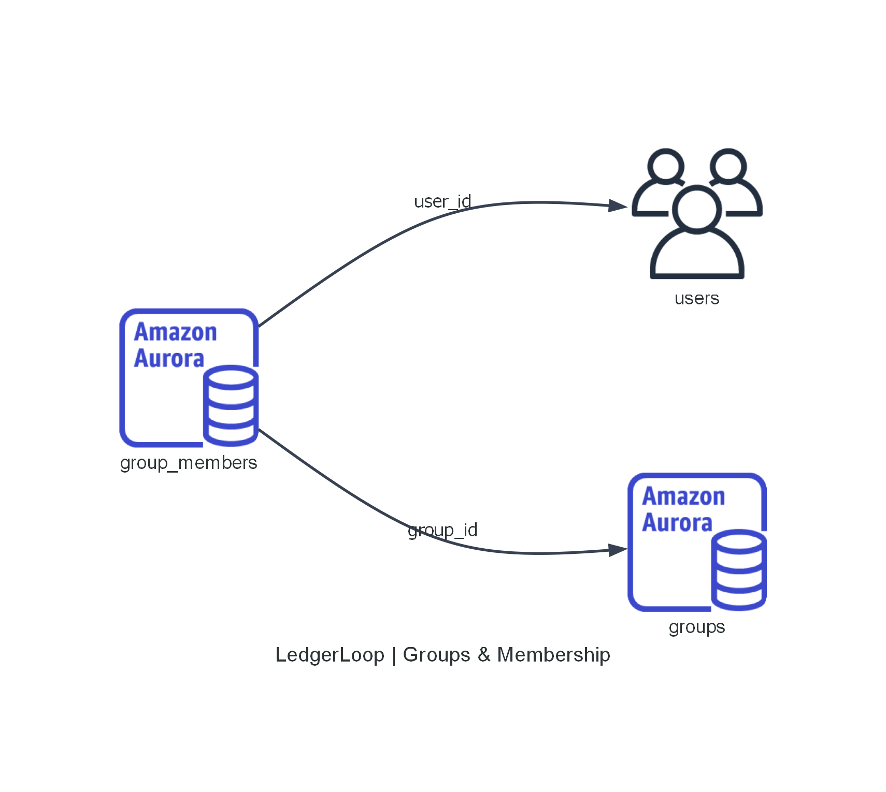
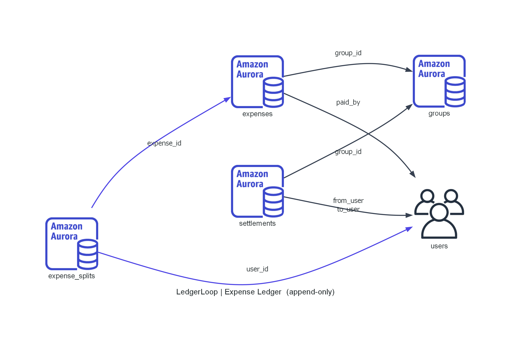
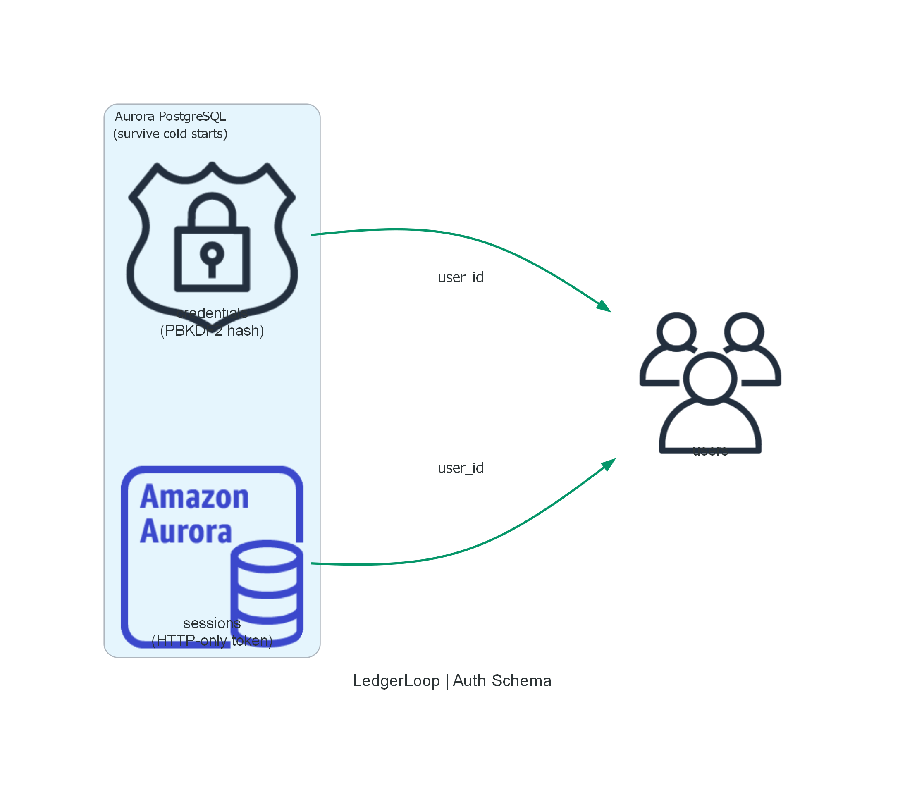

# LedgerLoop

Group expense ledger. Shared balances stay correct even when people in different cities write at the same time.

Built for the H0 Hackathon — AWS + Vercel. Deadline: June 30, 2026.

Live: [ledgerloop-delta.vercel.app](https://ledgerloop-delta.vercel.app)

> "We didn't pick Aurora PostgreSQL because it's fashionable. We picked it because a group ledger has a math invariant — balances across a closed group must sum to zero — and serializable isolation makes violating that invariant impossible to ignore. The database aborts the conflicting write and forces a retry. No silent corruption."

---

## What it does

LedgerLoop tracks shared expenses, figures out who owes what, and lets members settle up. Three friends across three continents add an expense at the same second — both writes land correctly, balances stay exact.

What's in scope: expense splitting (equal, percentage, or exact amounts), debt simplification, settlement recording, and concurrency safety. Remainders are distributed deterministically — ₦1,000 ÷ 3 is 334 + 333 + 333, never 999.

What's not: moving real money. This tracks and simplifies debt only.

---

## Architecture

One Next.js deployment on Vercel, one Aurora PostgreSQL database.



```
Browser (Lagos / London / Toronto)
    │
    ▼
Vercel — Next.js App Router
    ├── Server Components (initial render, data fetch)
    ├── Client Components (live balance display, forms)
    └── Server Actions (all write operations)
            │
            ▼
        Ledger Service
            ├── Auth Guard          membership check before every read/write
            ├── Split Calculator    INV-1: shares always sum to expense amount
            ├── Balance Engine      INV-2: group balances always sum to zero
            ├── Debt Simplifier     greedy min-cashflow reduction
            ├── Settlement Validator INV-5: settlement ≤ what's owed
            └── withOccRetry        INV-3: transparent retry on 40001
                    │
                    ▼
            Aurora PostgreSQL
                Append-only ledger: expenses, splits, settlements
                Reference state: users, groups, memberships
                Serializable isolation (SQLSTATE 40001 on conflict)
```

Balance is an output, not stored state. Deriving it from an immutable ledger on every read means there's nothing to get out of sync. Writes only append rows, so conflicts are rare. Single database means no cross-service coordination to get wrong.

### addExpense write path



### Registration flow



### Sign-in and session lookup



### Database schema — groups and membership



### Database schema — expense ledger (append-only)



### Database schema — auth tables



---

## Tech stack

| Layer | Choice |
|---|---|
| Framework | Next.js 15 (App Router) |
| Language | TypeScript strict mode, enforced in CI |
| Styling | Tailwind CSS with shared design tokens |
| Components | Radix UI headless primitives |
| Database | Aurora PostgreSQL Serverless v2 |
| DB driver | `postgres` (porsager) |
| Auth | Session cookie, PBKDF2-HMAC-SHA256 hashing |
| Hosting | Vercel |
| Testing | Vitest + fast-check + axe-core |

---

## Project structure

```
src/
├── app/
│   ├── (auth)/              Register + sign-in
│   ├── (app)/               Session-guarded segment
│   │   └── groups/          List, create, join, view, add expense, settle
│   ├── layout.tsx           Root layout (ARIA landmarks, skip-to-content)
│   └── globals.css
├── components/
│   ├── ui/                  MoneyAmount, MoneyInput, SubmitButton, Label
│   ├── expense/             AddExpenseFlow (live split preview)
│   ├── balance/             BalanceSummary, SimplifiedPlan
│   └── settle/              SettleUpForm
├── domain/                  Pure domain core — no I/O, property-tested
│   ├── types.ts             SplitType, Split, ExpenseInput, Transfer
│   ├── result.ts            Result<T>, DomainError, ok/err helpers
│   ├── money.ts             ISO-4217 validation, parseMajorToMinor, formatMinor
│   ├── split-calculator.ts  equalSplit, percentSplit, exactSplit
│   ├── balance-engine.ts    deriveNetPositions, derivePairwiseDebts
│   ├── debt-simplifier.ts   simplifyDebts
│   ├── settlement-validator.ts  maxSettleable, validate
│   └── currency-display.ts  read-time FX conversion, never mutates stored data
├── ledger/
│   ├── persistence.ts       Persistence interface + row types
│   ├── in-memory-persistence.ts  Fake for tests and local dev
│   ├── occ-retry.ts         withOccRetry (bounded, jittered backoff)
│   ├── auth-guard.ts        Membership enforcement
│   ├── services.ts          registerMember, createGroup, joinGroup
│   ├── orchestration.ts     addExpense, recordSettlement, correctExpense
│   └── aurora/              Real Aurora PostgreSQL adapter
│       ├── schema.sql       Standard PG DDL: foreign keys, indexes, SERIALIZABLE
│       ├── connection.ts    Pooled connection
│       └── aurora-persistence.ts
└── lib/
    ├── auth.ts              Session management (HTTP-only cookie)
    ├── auth-store.ts        Credential store
    ├── persistence-factory.ts  AURORA_HOST → AuroraPersistence, else InMemory
    └── logger.ts            PII-free logging

test/
├── domain/          12 property tests (INV-1 through INV-5)
├── ledger/          OCC retry, auth guard, services, orchestration
├── api/             PII exclusion, auth lifecycle
└── frontend/        axe-core accessibility, contrast, responsive, touch
```

---

## Correctness invariants

Six invariants, each thrown at 100+ random inputs by fast-check:

| # | Invariant | Enforced by |
|---|---|---|
| INV-1 | `Σ(splits) == expense amount` | Split Calculator + atomic transaction |
| INV-2 | `Σ(balances) == 0` across a group | Balance Engine derivation |
| INV-3 | No double-counting under concurrency | Aurora SERIALIZABLE + withOccRetry |
| INV-4 | Money is always integer minor units | BIGINT storage, no floats |
| INV-5 | Settlement ≤ what's owed | Settlement Validator against derived ledger |
| INV-6 | Every row references a real entity | Auth Guard + DB foreign keys |

27 correctness properties total. The settlement direction property catches a flipped sign that a sum-to-zero check alone misses — that one nearly got me.

---

## Getting started

### Local development (no database needed)

```bash
npm install
npm test        # 138 tests, all pass against the in-memory fake
npm run typecheck
npm run dev     # localhost:3000
```

No AWS account required. `InMemoryPersistence` handles everything locally.

### With Aurora PostgreSQL

```bash
AURORA_HOST=your-cluster-endpoint.cluster-xxxx.us-east-1.rds.amazonaws.com
AURORA_PORT=5432
AURORA_DB=ledgerloop
AURORA_USER=ledgerloop_admin
AURORA_PASSWORD=your-password
```

Run the schema once:

```bash
psql "host=$AURORA_HOST port=$AURORA_PORT dbname=$AURORA_DB \
  user=$AURORA_USER password=$AURORA_PASSWORD sslmode=require" \
  -f src/ledger/aurora/schema.sql
```

Then `npm run dev`. The persistence factory switches automatically when `AURORA_HOST` is set.

---

## Deployment

1. Provision Aurora PostgreSQL Serverless v2 in AWS.
2. Add the five `AURORA_*` env vars to your Vercel project.
3. Run the schema SQL against the cluster once.
4. Push to GitHub — Vercel deploys automatically.

Or: `npx vercel --prod`.

### Environment variables

| Variable | Required | Notes |
|---|---|---|
| `AURORA_HOST` | Production | Aurora writer endpoint |
| `AURORA_PORT` | No | Default `5432` |
| `AURORA_DB` | No | Default `ledgerloop` |
| `AURORA_USER` | No | Default `ledgerloop_admin` |
| `AURORA_PASSWORD` | Production | DB password |

When `AURORA_HOST` is unset the app falls back to `InMemoryPersistence`. All 138 tests pass with no database at all.

---

## Testing

```bash
npm test              # everything
npm run test:watch    # watch mode
npm run lighthouse    # performance gates (requires deployed build)
```

24 test files, 138 tests. What they cover:

- 27 property-based tests via fast-check, ≥100 iterations each
- 12 axe-core accessibility checks (zero violations)
- 18 contrast, keyboard, label, and error-association checks
- 13 responsive and touch structure tests
- Lighthouse CI gates: LCP ≤ 2.5s, CLS ≤ 0.1

The OCC retry path is tested by injecting `40001` failures on demand into the in-memory fake. No live database required for any of it.

---

## Accessibility

WCAG 2.1 AA across all core flows. Every form control has an associated `<label>`. Errors go through `aria-describedby`, not color alone. Balance status uses text labels and icons. Skip-to-content link present. Touch targets are 44×44px minimum. Live balance updates use `aria-live="polite"`. Contrast ratios verified against design tokens at 4.5:1 and 3:1.

---

## Design decisions worth explaining

**Balance is derived, never stored.** The classic lost-update bug happens when you store a running total and two writes race to update it. We don't store it at all — every read derives it from the immutable ledger. Nothing to corrupt.

**Append-only ledger.** Expenses and settlements are inserts only. Corrections are new reversing rows, not edits. This keeps the conflict surface narrow: two inserts with different UUIDs rarely collide.

**Integer minor units everywhere.** IEEE 754 cannot represent 0.1 exactly. ₦10.50 stored as a float might come back as 10.4999...97. So everything is stored as kobo, cents, pence — integers. `BIGINT` in the database, `number` in TypeScript (safe up to ±2⁵³ − 1). Formatting only happens at the display layer.

**Validation before any write.** A rejected operation writes nothing. No partial state.

**Single database.** Concurrency correctness is Aurora's job, not the application's. Cross-service sagas trade one hard problem for three.

---

## Scripts

| Script | What it does |
|---|---|
| `npm run dev` | Next.js dev server |
| `npm run build` | Production build (typecheck + lint run) |
| `npm run start` | Serve the production build |
| `npm run lint` | ESLint |
| `npm run typecheck` | TypeScript strict check |
| `npm test` | All tests |
| `npm run test:watch` | Watch mode |
| `npm run lighthouse` | Lighthouse CI gates |

---

## Hackathon

Track: AWS + Vercel (H0 Hackathon).

The pitch: a group ledger has a correctness invariant that eventual consistency can't hold. Aurora PostgreSQL's serializable isolation surfaces conflicts as retryable errors instead of silent wrong balances. The architecture follows directly from that guarantee.

The demo: two simultaneous writes, one gets `40001`, retry succeeds, both land, INV-2 holds. Then 12 debts collapse to 4 payments in the UI.
